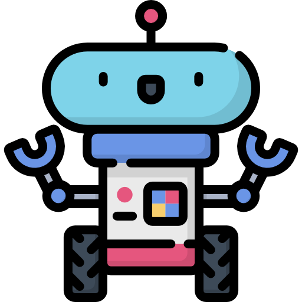

<!-- PROJECT LOGO -->
 

  

  <h3 align="center">RoboGlove</h3>

  

    Group 17's project in Programming of robots and other physical devices.
     
  

<!-- ABOUT THE PROJECT -->

## About The Project

Group 17's Programming of robots and other physical devices at SDU. 

The final solution consists of a car and a controller for the car. The main component of the car and controller is a ESP32 microcontrollers(ESP). The ESPs use ESP-NOW, a protocol developed by Espressif that allows numerous ESPs to connect without using WiFi. The protocol, according to Espressif, is identical to the low-power 2.4GHz wireless communication seen in wireless mice. Each ESP has its own MAC Address, which we use to identify it so we can control where the data is sent. The ESPs use two-way communication where both ESPs are senders and receivers.

More details will be added later.

### Built With

- [Arduino IDE](https://www.arduino.cc/en/software)
- [C++]
- [ESP32 Devkitc v4]
- [Ultra Sonic Sensor]

<!-- USAGE EXAMPLES -->

## Usage

To be added.

<!-- LICENSE -->

## License

Distributed under the MIT License. See `LICENSE.txt` for more information.

